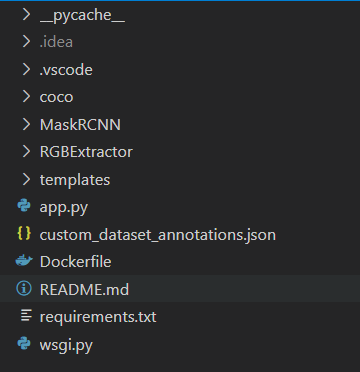

# Flask Server

- MaskRCNN, ExtractRGB 2개 모델을 사용
- 폴더 구조



# Installation

- Docker 환경 필수

```bash
#app폴더와 Dockerfile 있는 곳에서
docker build -t server .

#server image 생성 뒤.
docker run --name flask_server -p 8888:3000 server
#name과 port는 임의 설정가능 (뒤에 3000번 포트는 고정)
```

- trained model(Weight file)<br>
[mask_rcnn_Season.h5](https://drive.google.com/file/d/1V-SOJiEyIdidsY_1r8SQ8JS-vQqVH5Fi/view?usp=sharing) (~244MB)
 
 insert in ```MaskRCNN/model1/samples/custom/```

- Dockerfile
    
    ```jsx
    FROM python:3.6.8
    
    COPY ./app /app
    
    WORKDIR /app
    
    RUN pip install --upgrade pip
    RUN apt-get update && apt-get install -y --no-install-recommends apt-utils
    RUN pip install opencv-python
    RUN pip install -r requirements.txt
    
    WORKDIR /app/coco/PythonAPI
    RUN yes | pip uninstall h5py
    RUN yes | pip install 'h5py<3.0.0'
    RUN apt update
    RUN yes | apt-get install gcc
    RUN yes | apt-get install libgl1-mesa-glx
    RUN python setup.py install
    
    EXPOSE 3000
    
    WORKDIR /app
    //worker의 갯수는 임의로 조정가능.
    CMD ["gunicorn", "app:app", "-b", "0.0.0.0:3000", "--timeout", "0", "-w", "4", "--worker-class", "gevent"]
    ```
    
- requirement.txt
    
    ```jsx
    tensorflow==1.15.2
    scikit-learn
    Pillow==8.1.0
    numpy
    scikit-image
    imutils
    Cython
    keras==2.3.1
    IPython
    imgaug
    flask-cors
    werkzeug
    gunicorn
    gevent
    ```
    

# API

- [http://j5b206.p.ssafy.io:8888/](http://j5b206.p.ssafy.io:8888/)model [POST, image]
- Image 요청 시 20~25초 소요